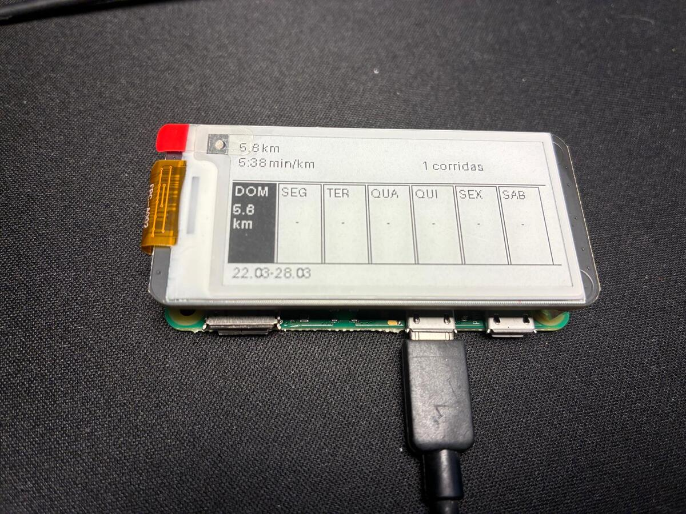
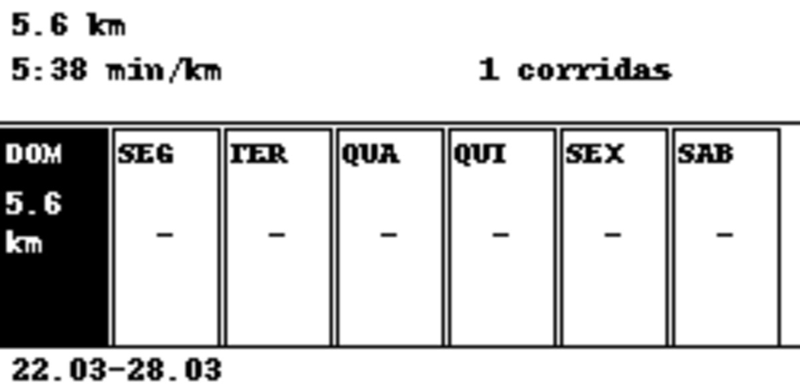

# running_dashboard

A minimalist e-ink dashboard for runners. Fetches your weekly activity data from Strava and displays it on a Waveshare 2.13" e-ink display connected to a Raspberry Pi.

## Photos
 
| Display | Setup |
|--------|-------|
|  |  |
 

---
 
## How it works
 
The dashboard pulls your running activity from the Strava API every 6 hours and renders a 250×122px 1-bit image directly to the e-ink display via SPI.
 
```
Strava API → running_dashboard.py → eink_display.py → Waveshare 2.13"
```
 
Each refresh shows:
- Total weekly distance and average pace
- Number of runs
- A 7-day grid — black cell means you ran that day, white means rest
- The date range of the current week
 
---
 
## Hardware
 
- Raspberry Pi Zero 2 W (or any Pi)
- Waveshare 2.13" e-ink HAT V3/V4
- MicroSD card with Raspberry Pi OS
 
The Waveshare HAT connects directly to the GPIO header — no wiring needed.
 
---
 
## Setup
 
### 1. Enable SPI
 
```bash
sudo raspi-config
# Interface Options → SPI → Enable
sudo reboot
```
 
### 2. Clone the repo
 
```bash
git clone https://github.com/g-vcs/running_dashboard
cd running_dashboard
```
 
### 3. Install the Waveshare library
 
```bash
git clone https://github.com/waveshare/e-Paper ~/e-Paper
```
 
### 4. Create a virtual environment and install dependencies
 
```bash
python3 -m venv venv
source venv/bin/activate
pip install requests python-dotenv pillow gpiozero lgpio
```
 
> If `lgpio` fails to build, install the system dependency first:
> ```bash
> sudo apt install swig liblgpio-dev -y
> pip install lgpio
> ```
 
### 5. Configure Strava credentials
 
Create a `.env` file in the project root:
 
```
STRAVA_CLIENT_ID=your_client_id
STRAVA_CLIENT_SECRET=your_client_secret
```
 
Get these values from [strava.com/settings/api](https://www.strava.com/settings/api).
 
### 6. Add your tokens
 
Create a `tokens.json` file with your initial Strava tokens:
 
```json
{
  "access_token": "your_access_token",
  "refresh_token": "your_refresh_token",
  "expires_at": 0
}
```
 
The app will automatically refresh the access token when it expires.
 
---
 
## Running
 
```bash
source venv/bin/activate
python eink_display.py
```
 
To preview the layout without the display hardware:
 
```bash
python eink_mock.py
# outputs dashboard.png
```
 
---
 
## Auto-refresh with cron
 
To update the dashboard every 6 hours:
 
```bash
crontab -e
```
 
Add this line(will update every 6 hours):
 
```
0 */6 * * * cd /home/pi/running_dashboard && /home/pi/running_dashboard/venv/bin/python eink_display.py
```
 
---
 
## Project structure
 
```
running_dashboard/
├── running_dashboard.py   # Fetches and processes Strava data
├── strava_tokens.py       # Handles OAuth token refresh
├── eink_display.py        # Renders to the e-ink display
├── eink_mock.py           # Renders to dashboard.png for local preview
├── tokens.json            # Strava tokens (not committed)
└── .env                   # Strava credentials (not committed)
```
 
---